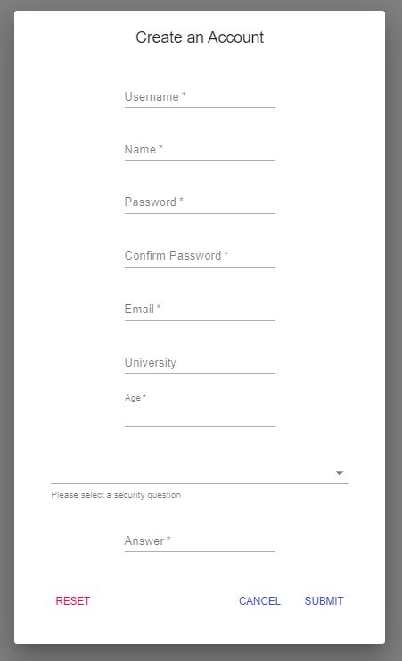
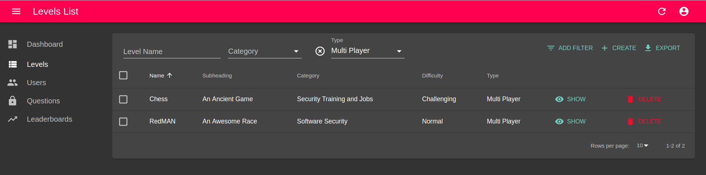

# Security Training Gamification

A `React` based portal for navigating and playing Unity based games. Aimed to be used to develop Unity based games, for teaching cyber-security to working professionals. The portal is intended to serve as a system where users can register, navigate and play games and see their positions on leaderboard and track progress.

## Implementation
1. Backend Architecture: `NodeJS` and `MongoDB`.
2. Frontend: `React`

For installation and other technical details refer to [`INSTALL.md`](INSTALL.md).

## Features:
### For Users
* User login, registration and authentication system.

Login             |  Password Reset
:-------------------------:|:-------------------------:
  |  

Registration             |  Edit Profile
:-------------------------:|:-------------------------:
  |  

* Navigating and playing games
    * Read game descriptions, rules and other info
    * Click 'play' to be redirected to game
    * Apply filters to filter games by category and difficuly
    * Mark games as favourite

* Leaderboard

* Utility

### For Admins
* Manage Games
    * View and filter games
    * Create new games and Edit existing

* Manage Users

* Manage Security Questions